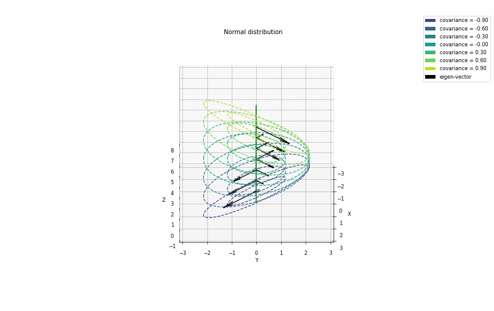
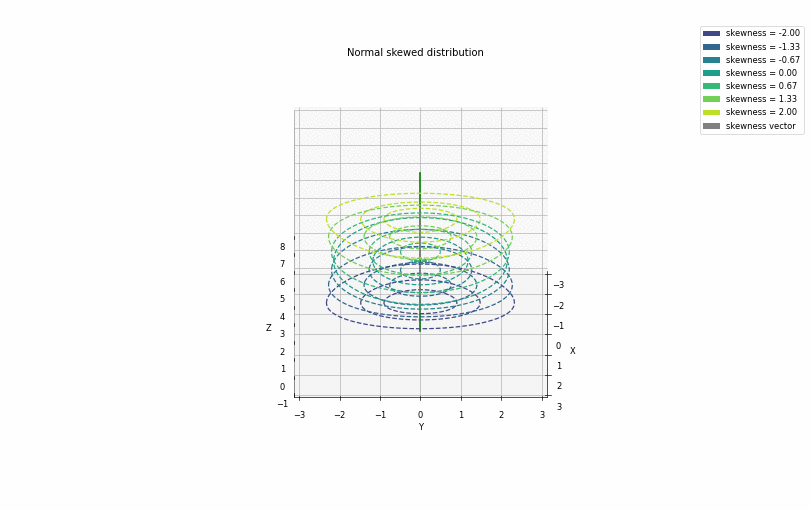
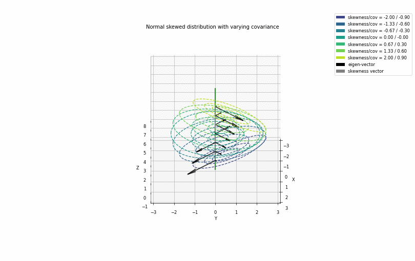

# statistics

Package enclosing common functions related to statistics, which are not directly available or lact flaxibility in implementaion in packages such as *scipy* and *numpy*.

## Tutorial 1 
Tutorial 1 illustrates the implementaiton of Normal (Gaussian) distributon. The distribution function is implemented through *einstein notation*.

#### Illustration of Normal distribution with varying covariance

#### Illustration of Normal distribution with skewness

#### Illustration of Normal distribution with varying covariance and skewness

