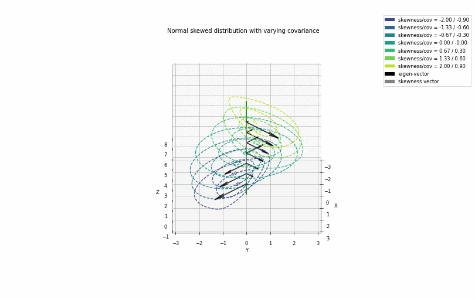

# statistics

Package enclosing common functions related to statistics, which are not directly available or lack flexibility in implementaion in packages such as *scipy* and *numpy*.

## Tutorial 1 
Tutorial 1 illustrates the implementaiton of Normal (Gaussian) distributon.

#### Illustration of Normal distribution with varying covariance

#### Illustration of Normal distribution with skewness

#### Illustration of Normal distribution with varying covariance and skewness

## Tutorial 2
Tutorial 2 illustrates a boundary effect when 2 Normal Skew distributions meet.

#### Illustration of Normal distribution with varying covariance and skewness

## Tutorial 3
Tutorial 3 illustrates multivariate skew normal distribution class with derivative evaluation and random sampling.

#### Illustration of Normal Skew distribution class
